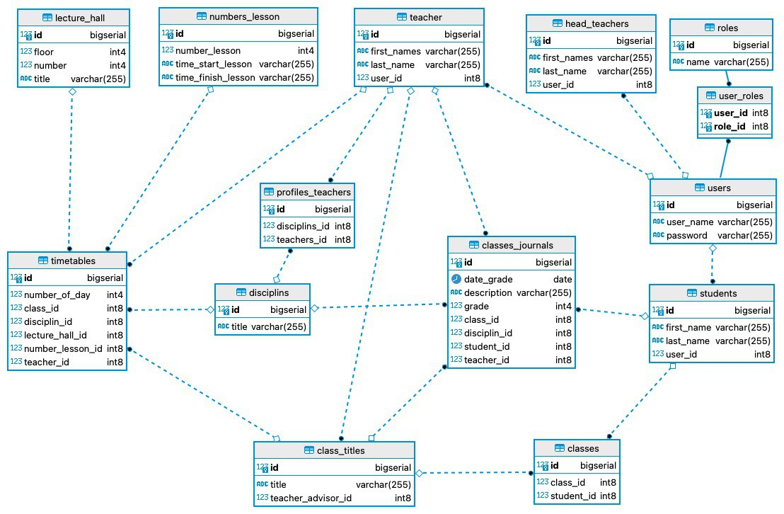

# Учебный проект "Виртуальная школа (ESSW - Education Service SoftWare)"

Клиент-серверное web-приложение c использованием монолитной архитектуры.

Приложение сосстоит из 2-х частей - серверной (backend) и клиентской (front).

Front - предоставляет конечному пользователю UI для работы с сервисами, необходимыми для управления образовательным учреждением, а именно - расписание уроков, просмотр успеваемости, авторизация в системе, администраторские функции (завуч).

Backend - обслуживает запросы поступающие от Front на выборку/сохранение данных из/в БД, а также формирует представления для отображения на Front.

Структура БД:

БД разворачивается и работает в Docker.

При создании использованы:

    OracleJDK 17,
    SpringBoot,
    SpringData JPA,
    SpringSecurity,
    Thymeleaf,
    HTML,
    Bootstrap
    FlyWay,
    PostgreSQL,
    Docker

Для запуска выполнить по порядку:
    
1. Развернуть образ в Docker, для этого необходимо в проекте запуститть файл docker-compose.yaml
2. После этого выполнить ./ru/sber/pm/esswfinalproject/EsswFinalProjectApplication
   
                            

